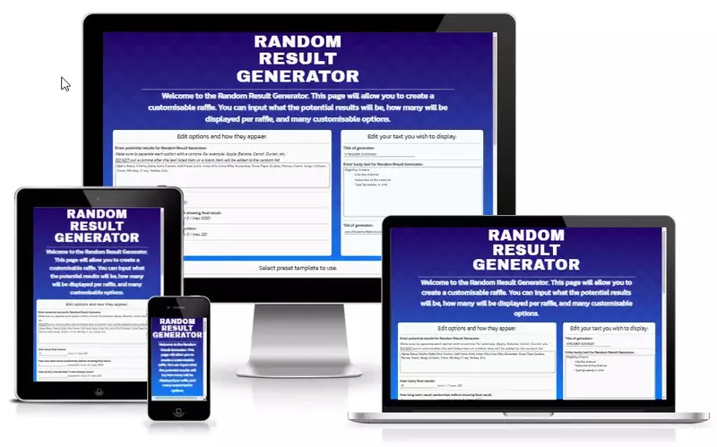

# Random Result Generator



## Live Site
Random Result Generator - [https://bobwritescode.github.io/ci-Project2](https://bobwritescode.github.io/ci-Project2)

## Repository
[https://github.com/BobWritesCode/ci-Project2](https://github.com/BobWritesCode/ci-Project2)

***
## Table of Contents
- [Objective](#Objective)
- [Brief](#Brief)
- [User Experience Design](#User-Experience-Design)
    - [User Requirements](#User-Requirements)
- [Initial Concept](#Initial-Concept)
    - [Wireframes](#Wireframes)
    - [Colour Scheme](#Colour-Scheme)
    - [Typography](#Typography)
    - [Imagery](#Imagery)
- [Features](#Features)
    - [Existing Features](#Existing-Features)
    - [Features Left to Implement](#Features-Left-to-Implement)
- [Technologies Used](#Technologies-Used)
- [Testing](#Testing)
    - [Validator Testing](#Validator-Testing)
    - [Screen Size](#Screen-Size)
    - [Browsers](#Browsers)
    - [Bugs](#Bugs)
- [Deployment](#Deployment)
- [Credits](#Credits)

***
## Objective 

Random Result Generator is a site to help the end user be able to run a raffle type giveaway or just to help make a choice. The site has a range of multiple targets including companies looking to provide a virtual giveaway live, all the way to someone who just wants to decide on what takeaway they are having that evening. The site has a lot of potential to go further from its current state and this is mentioned in the [Features Left to Implement](#Features-Left-to-Implement) of this README.

***
## Brief

My goals for the site are to have:
- a generator that provides random results based on the user's input.
- a way for the user to input their own potential results.
- a way for the user to customise how many results they get from the generator.
- a way for the user to customise the generator to fit their own brand.
- a way for the user to easily modify their choices.

***
## User Experience Design

### User Requirements

Some example user stories which will affect the design and functions of this site:
- *"As a first-time visitor, I want to know what this site is about. I may use several different devices (mobile/tablet etc.) to view the site. I would like to be able to navigate easily"*
- *"I want to have easy-to-follow steps and nothing being over complicated"*
- *"I want it to be dummy-proof. If there are any errors, please help me in correcting them."*
- *"I am a streamer want to be able to share the results on my live broadcast to my viewers."*
- *"I am a officer manager and I want to be able to share the results on a TV screen."*

***
## Initial Concept

### Wireframes

You will see that when I first set out to design this site, I had an idea of what I was going for but as time progress and new ideas came to mind, the final outcome is much different.

#### Initial wireframe


From the original wireframe the following changes have been made:
  - Options Area 1 became the area dedicated for user outcomes and how the results are revealed
  - Options Area 2 became the area for user text input that will be shown at the top, middle (pre result generation starting) and the bottom (tail) of the generator.
  - Results Area was made into its own container that appears when the generator is launchers.
  - There are have been several new sections added as well including:
    - Colour pre-set templatess,
    - User colour inputs,
    - Background pre-set templates,
    - Option to launch full screen.

### Colour Scheme
\
The idea behind this colour scheme is give a modern and impactful feel without being distracting for the end-user.

### Typography

The site uses [Google Fonts](https://fonts.google.com/).

  - Main header - [Archivo Black](https://fonts.google.com/specimen/Archivo+Black)\
  This font was chosen as the main header as for its impact and clarity.

  - Rest of text - [Kanit](https://fonts.google.com/specimen/Kanit)\
  This font was chosen as it felt to me it gave a party typewriter, party code feel. Which I felt suited a site that is focused on user input and then automated generation of results.

### Imagery

No imagery is planned to be used.

***
## Features
Random Result Generator is filled with features for the end user and there is a lot of stuff also happening in the background. In this section we will breakdown the different features and what is happening in the background.

### Existing Features

#### Desktop and Mobile viewing

It was important to make sure that this site worked across mobile and desktop. Using Flex and a combination of viewport typography the site displays very well across different screen sizes.

  - **Desktop**\
  \
  
  - **Mobile**\
  


#### User options

\
**"Edit options and how they appear:"**\
The first section is designed for the user to input their potential outcomes and some basic options on how the results will output.

  - **"Enter potential results for Random Result Regenerator"**\
    In this section the user can input their own options to what they wish to get random results for. For the ease of testing, I have provided some sample options as an example. The user just needs to make sure each option is separated with a comma and the last option on the list does not end in a comma.

  - **"How many final results:"**\
    User can decide how many results will appear. Using CSS and JavaScript I have made sure that the generator scales the `div`s and font size appropriately.

  - **"How long each result randomises before showing final result:"**\
    User can decide how long between each result until the next one is shown. As default it is set to 2 seconds.

  - **"Can an option win multiple times:"**\
    User can decide if options from their list can appear multiple times in the same random generated results.

  - 

  - **"Edit your text you wish to display:"**\
    This section is more dedicated to user text input for the Generator, what they want to see as the Title, the text they want to display in the centre before starting the randomising and the tail text at the bottom of the screen. 
    

  - **Pre-set template select**\
    \
    The user can choose from currently 1 or 3 pre-set colour templates. Using CSS and JavaScript there is onscreen feedback to the user by a green border appearing around the selected option.

  - **User colour picker**\
    \
    The user can decide what colour scheme they wish to have for the generator. This can be very helpful if the user wants to keep it on brand. 

  - **User background picker**\
    \
  The user can pick a solid colour background, which they can use the colour picker to choose. This is useful if the user wants to display results on a livestream and have a transparent background using chroma key[^1]. Or there are some pattern backgrounds created using CSS (Credit to [SVG Backgrounds](https://www.svgbackgrounds.com/)).

  - **Optional full screen**\
    \
    The user has the option to open the generator full screen. This could be useful if the results are being revealed in person and the results are being shown on a big screen to an audience of people.

  - **Button - Load the generator**\
    \
    This button will run the JavaScript function `loadGenerator()`.

  - **Footer**\
    \
    The footer is just to help the user experience and let them know they have reached the bottom of the page.

  - **Error Handling**\
    \
    JavaScript makes sure there are no errors within the form before trying to load the generator in the function `formValidation()`.\
    Any errors identified an appropriate error message is shown and the field is highlighted to the user to assist in easier correction.

#### Generator

  - **Button - Start**\
    \
    This button runs the JavaScript function `startGenerator()`.
    The `startGenerator()` runs the `countdown()` function.

  - **Button - Close**\
    \
    This button will run the JavaScript function `exitGenerator()`.
    The `exitGenerator()` function will hide the generator element and display the initial front end elements.

  - **Countdown**\
    \
    Once the countdown has reached zero, the `countdown()` function will run the `createRandomResults()` function.

  - **Randomising results**\
    \
    Using the function `resultRandomAnimFunc()`. Which takes all the options the user input in the text area and randomly showing them until the counter runs out. At which point the transition delay time would have reached 0 set by `show1By1()`.

  - **Result reveal**\
    \
    Once the random animation has stopped the real result will be revealed and change the colour to the final colour set by the user or pre-set.

  - **Tested with 5000 entries**\
    \
    I tested with 5000 potential results in 1 generator and ran into no issues with the code being able to handle a large number of results in 1 array. 

### Features Left to Implement

The random result generator future possible features are potentially endless. Here are just some of the ideas I have for this site:
  - Image upload: Allow users to upload their own image for as a background and / or company logo.
  - Premium features: Provide premium features so the site can start to earn a passive income.
  - Share: Have a shareable link for each generator that will either send with or without already determined results.
  - Improved result layout: Currently results are shown in a column structure only. Future updates will have the results in a grid format that could be set for the user
  - More ways to reveal results: The user will be able to choose how the results are revealed instead of the current random animation. i.e. If they want to have the results scroll down the page and stop at the final result.
  - Countdown for each result: An option where the user can have a countdown until the final result appears while the randomising animation is happening. This could be useful if the user puts in a longer timer to reveal the result.

***
## Technologies Used

**HTML** for the front end. This is the structure of the site of what the end-user sees in their browser.

**CSS** for the front end. This provides the style, the colours, the font, everything that the end-user see in their browser.

**JavaScript** as the engine. JavaScript plays a very heavy role in this site. It is responsible for making sure everything is displayed correctly, and the generator works as intended.


***
## Testing 

### Validator Testing 

  - HTML\
  No errors were returned when passing through the official [W3C validator](https://validator.w3.org/nu/#textarea).

  - CSS\
  No errors were found when passing through the official [W3C validator](https://jigsaw.w3.org/css-validator/#validate_by_input).
  
  - JavaScript\
    No errors were found when passing though [JS Hint](https://jshint.com/).

### Google Chrome Lighthouse

  \
  

### Screen Size

The site has been made to be responsive for all screen sizes, including screen size width of 320px.

### Browsers

- PC 
  - Goggle Chrome (Version 105.0.5195.54 (Official Build) (64-bit))
    - No issues identified
  - Microsoft Edge (Version 104.0.1293.70 (Official build) (64-bit))
    - No issues identified
  - Opera (Version 90.0.4480.54)
    - No issues identified
  - Firefox (Version 104.0.1 (64-bit))
    - There are some styling discrepancies but no issues identified with functionality or useability.
- Android Phone - Goggle Chrome (Version 105.0.5195.68)
  - No issues identified

### Bugs

#### Unfixed

Through testing all modern browsers have been able to run the site with no problems to functionality. Though while testing Firefox there were some minor CSS styling issues:
  - `<hr>` line was not white,
  - Some text aligned to left instead of centre.
As these do not currently affect the functionality of the site there is no immediate need to fix but will be something to investigate for the future if this project moves forward to becoming a fully functional site.

#### Resolved

There are currently no functionality bugs I am aware of in the modern browsers I have tested.

#### Troubleshooting errors

Throughout the projects while coding in JavaScript I have come across errors in coding and got unexpected results. Which I have troubleshoot by using common practices like `console.log()` in combination with Google Chrome console.
I also used Google search engine to help find solutions from popular websites like [Stack Overflow](https://stackoverflow.com/).

***
## Deployment

### GitHub Pages
The project was deployed to GitHub Pages using these steps:

1. Log in to GitHub and go to the [GitHub Repository](https://github.com/BobWritesCode/ci-Project2)
2. Locate the Navbar at the top of the Repository (not top of page). Click the Settings tab.
3. Locate the Navbar on the left-hand side of the page. Click the "Pages" section (under 'Code and automation').
4. Under "Source", click the dropdown called "None" and select "main". Click save.
5. The page will automatically refresh.
6. A notification will appear at the top of the page with the [link](https://bobwritescode.github.io/ci-Project2/) to the deployed site. You can return to this GitHub Pages section to access the link.

### Forking the GitHub Repository
Forks are used to propose changes to someone else's project or to use someone else's project as a starting point for your own idea. By forking the GitHub Repository you make a copy of the original repository on our GitHub account to view and/or make changes without affecting the original repository.

To Fork a GitHub Repository:
1. Log in to GitHub and go to the [GitHub Repository](https://github.com/BobWritesCode/ci-Project2)
2. Locate the Fork button in the top-right corner of the page, click Fork.
3. You should now have a copy of the original repository in your GitHub account.

### Making a Local Clone
You will now have a fork of the repository, but you don't have the files in that repository locally on your computer.

To make a local clone:

1. Log in to GitHub and go to the [GitHub Repository](https://github.com/BobWritesCode/ci-Project2)
2. Above the list of files, click 'Code'.
3. To clone the repository using HTTPS, under "Clone with HTTPS", click the 'Copy' icon. To clone the repository using an SSH key, including a certificate issued by your organization's SSH certificate authority, click Use SSH, then click the 'Copy' icon. To clone a repository using GitHub CLI, click Use GitHub CLI, then click the 'Copy' icon.
4. Open Git Bash.
5. Change the current working directory to the location where you want the cloned directory.
6. Type git clone, and then paste the URL you copied earlier. It will look like this, with your GitHub AE username instead of YOUR-USERNAME:

```
$ git clone https://github.com/YOUR-USERNAME/YOUR-REPOSITORY
```

7. Press Enter. Your local clone will be created.

```
$ git clone https://github.com/YOUR-USERNAME/YOUR-REPOSITORY
> Cloning into `ci-Project1`...
> remote: Counting objects: 10, done.
> remote: Compressing objects: 100% (8/8), done.
> remove: Total 10 (delta 1), reused 10 (delta 1)
> Unpacking objects: 100% (10/10), done.
```

Click [Here](https://docs.github.com/en/github-ae@latest/get-started/quickstart/fork-a-repo) for the GitHub quick start guide with images and more detailed explanations of the above process.

***
## Credits 

### Content

  - All content is original and written by me.

### Code

  - Pattern CSS backgrounds - [SVG Backgrounds](https://www.svgbackgrounds.com/)
  - Fullscreen - [W3 Schools](https://www.w3schools.com/howto/howto_js_fullscreen.asp)

### Media and other

  - Favicon generated using [Favicon Generator](https://favicon.io/favicon-generator/)
  - Fonts - [Google Fonts](https://fonts.google.com/)

***
[^1]: [Wikipedia - Chroma Key](https://en.wikipedia.org/wiki/Chroma_key).