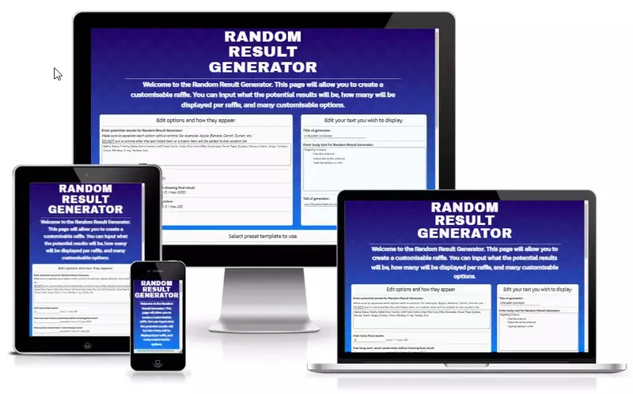

# Random Result Generator

## Live Site
Random Result Generator - [https://bobwritescode.github.io/ci-Project2](https://bobwritescode.github.io/ci-Project2)

## Repository
[https://github.com/BobWritesCode/ci-Project2](https://github.com/BobWritesCode/ci-Project2)

***
## Table of Contents
- [Objective](#Objective)
- [Brief](#Brief)
- [User Experience Design](#User-Experience-Design)
    - [User Requirements](#User-Requirements)
- [Initial Concept](#Initial-Concept)
    - [Wireframes](#Wireframes)
    - [Colour Scheme](#Colour-Scheme)
    - [Typography](#Typography)
    - [Imagery](#Imagery)
- [Features](#Features)
    - [Existing Features](#Existing-Features)
    - [Features Left to Implement](#Features-Left-to-Implement)
- [Technologies Used](#Technologies-Used)
- [Testing](#Testing)
- [Bugs](#Bugs)
    - [Current](#Current)
    - [Resolved](#Resolved)
- [Deployment](#Deployment)
- [Credits](#Credits)
    - [Code](#Content)
    - [Media](#Media)
    - [Miscellaneous](#Miscellaneous)

***
## Objective 

Random Result Generator is a site to help the end user be able to run a raffle type giveaway or just to help make a choice. The site has a range of multiple targets including companies looking to provide a virtual giveaway live, all the way to someone who just wants to make a decision on what takeaway they are having that evening. The site has a lot of potential to go further from where it currently is and this is mentioned in the [Features Left to Implement](#Features-Left-to-Implement) of this README.

***
## Brief
My goals for the site are to have:
- a generator that provides random results based on the user's input.
- a way for the user to input their own potential results.
- a way for the user to customise how many results they get from the generator.
- a way for the user to customise the generator to fit their own brand.
- a way for the user to easily modify thier choices.

***
## User Experience Design

***
### User Requirements

***
## Initial Concept
  ### Wireframes
  ### Colour Scheme
  ### Typography
  ### Imagery

***
## Features
  ### Existing Features
  ### Features Left to Implement

***
## Technologies Used

***
## Testing 

In this section, you need to convince the assessor that you have conducted enough testing to legitimately believe that the site works well. Essentially, in this part you will want to go over all of your project’s features and ensure that they all work as intended, with the project providing an easy and straightforward way for the users to achieve their goals.

In addition, you should mention in this section how your project looks and works on different browsers and screen sizes.

You should also mention in this section any interesting bugs or problems you discovered during your testing, even if you haven't addressed them yet.

If this section grows too long, you may want to split it off into a separate file and link to it from here.

### Validator Testing 

- HTML
  - No errors were returned when passing through the official [W3C validator](https://validator.w3.org/nu/?doc=https%3A%2F%2Fcode-institute-org.github.io%2Flove-running-2.0%2Findex.html)
- CSS
  - No errors were found when passing through the official [(Jigsaw) validator](https://jigsaw.w3.org/css-validator/validator?uri=https%3A%2F%2Fvalidator.w3.org%2Fnu%2F%3Fdoc%3Dhttps%253A%252F%252Fcode-institute-org.github.io%252Flove-running-2.0%252Findex.html&profile=css3svg&usermedium=all&warning=1&vextwarning=&lang=en#css)

***
## Bugs
### Unfixed
### Resolved

You will need to mention unfixed bugs and why they were not fixed. This section should include shortcomings of the frameworks or technologies used. Although time can be a big variable to consider, paucity of time and difficulty understanding implementation is not a valid reason to leave bugs unfixed. 

***
## Deployment

This section should describe the process you went through to deploy the project to a hosting platform (e.g. GitHub) 

- The site was deployed to GitHub pages. The steps to deploy are as follows: 
  - In the GitHub repository, navigate to the Settings tab 
  - From the source section drop-down menu, select the Master Branch
  - Once the master branch has been selected, the page will be automatically refreshed with a detailed ribbon display to indicate the successful deployment. 

The live link can be found here - https://code-institute-org.github.io/love-running-2.0/index.html 

***
## Credits 

In this section you need to reference where you got your content, media and extra help from. It is common practice to use code from other repositories and tutorials, however, it is important to be very specific about these sources to avoid plagiarism. 

You can break the credits section up into Content and Media, depending on what you have included in your project. 

### Content 

- The text for the Home page was taken from Wikipedia Article A
- Instructions on how to implement form validation on the Sign Up page was taken from [Specific YouTube Tutorial](https://www.youtube.com/)
- The icons in the footer were taken from [Font Awesome](https://fontawesome.com/)

### Code 
### Media

- The photos used on the home and sign up page are from This Open Source site
- The images used for the gallery page were taken from this other open source site

### Miscellaneous